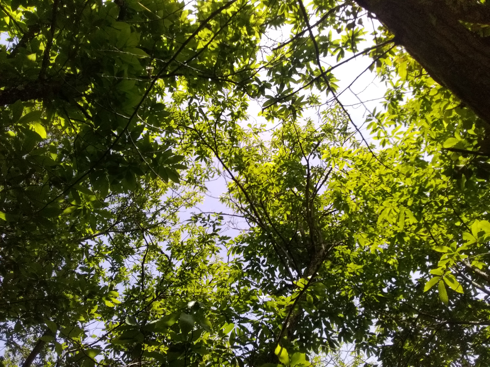

🌳 **Le châtaignier, un arbre emblématique de notre territoire** 🌳

Le châtaignier (_Castanea sativa_) est présent dans le Languedoc depuis plusieurs millénaires. Des analyses de pollen ont montré sa présence il y a plus de 5000 ans, notamment dans le secteur du Somail, tout près de notre territoire. Cet arbre fait donc partie intégrante de notre histoire locale.

Au fil du temps, il a été largement cultivé, soit en vergers pour la production de châtaignes, soit en taillis pour répondre à de nombreux besoins : alimentation des fours des verreries, production de charbon, fabrication de piquets de vignes ou encore de perches pour les parcs à huîtres de l’étang de Thau.

Avec l’évolution des pratiques agricoles, notamment viticoles, la demande en piquets de châtaignier a fortement diminué. La filière s’est affaiblie et, aujourd'hui, seuls quelques professionnels, notamment sur la commune de Courniou, perpétuent ce savoir-faire. Ce changement s’inscrit dans une transformation plus large du paysage : en 1914, on comptait 1000 hectares de forêt pour 2000 hectares de cultures, alors qu’aujourd’hui la tendance s’est inversée.

Pourtant, le châtaignier reste une essence précieuse. Riche en tanins, il est naturellement durable en extérieur sans traitement, ce qui en fait une alternative intéressante aux bois exotiques ou traités. Il offre de nombreux débouchés : charpente, menuiserie, parquet, piquets, bois énergie ou encore vannerie.

🎥 **Pour en découvrir davantage**, un magnifique documentaire réalisé par Frédéric Gleizes, membre de l’ASLGF, est disponible ici :

  <iframe width="560" height="315" src="https://www.youtube.com/embed/nR1p076406k" title="YouTube video player" frameborder="0" allow="accelerometer; autoplay; clipboard-write; encrypted-media; gyroscope; picture-in-picture" allowfullscreen></iframe>

