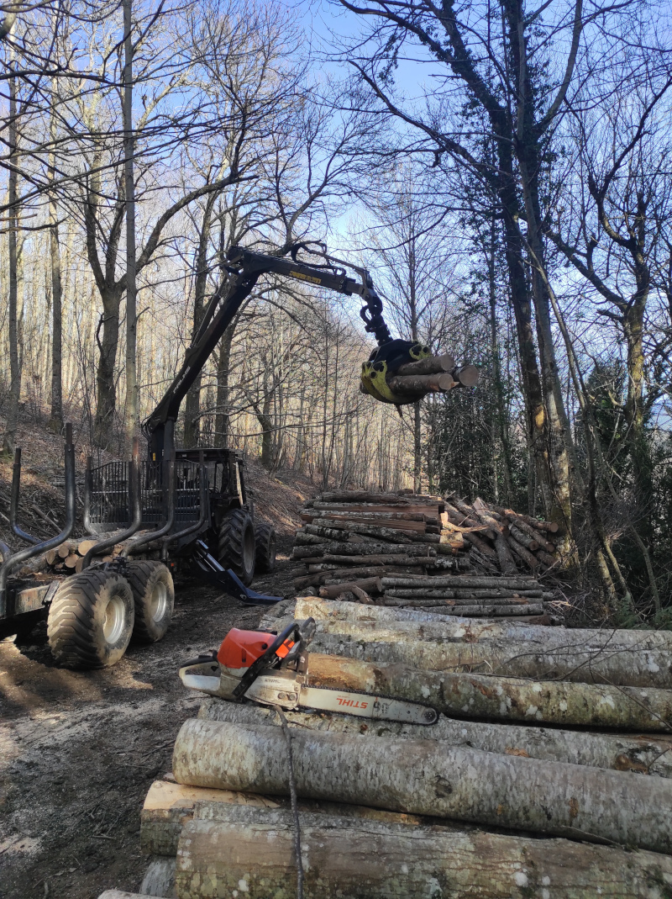
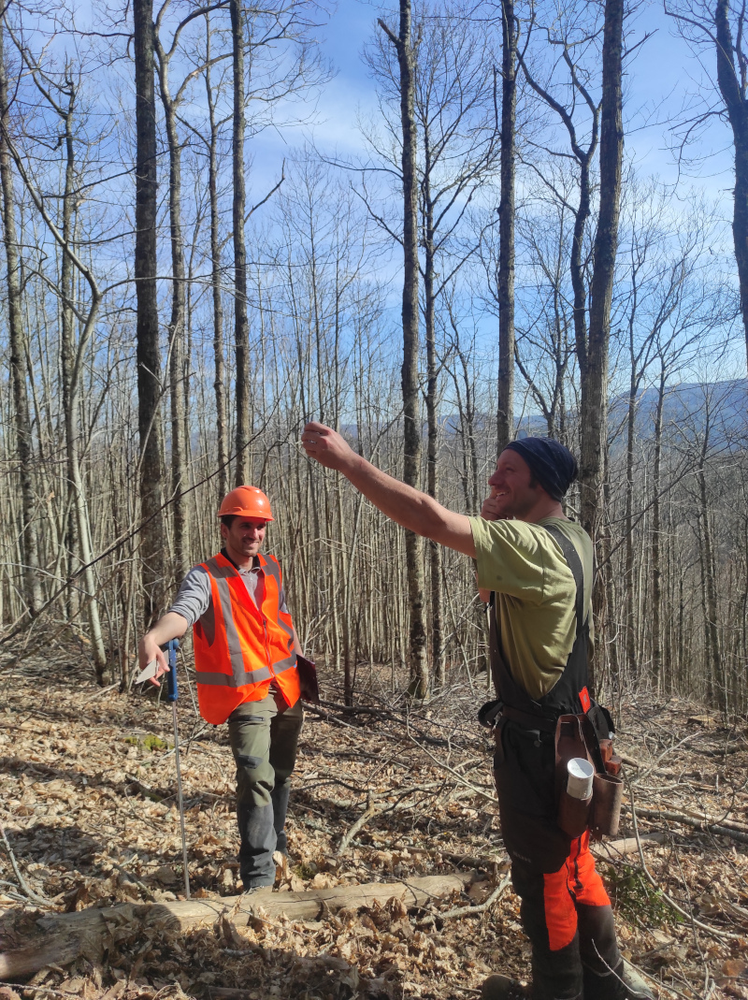

🌳 **Premier chantier d’éclaircie dans un taillis haut de châtaignier** 🌳

L’ASLGF du Pays Saint-Ponais est heureuse de partager le succès de son premier chantier d’éclaircie !

Pendant 4 jours, du lundi 9 mars au vendredi 13 mars, une équipe engagée composée de 2 bûcherons, d’une stagiaire bûcheronne et d’un débardeur équipé d’un tracteur forestier avec treuil a travaillé avec efficacité et professionnalisme.

Malgré un début de semaine marqué par les giboulées de mars, la météo s’est finalement montrée au beau fixe, offrant de bonnes conditions de travail sur la fin du chantier. Les débuts ont toutefois été rendus plus complexes par un peuplement particulièrement dense, nécessitant rigueur et précision dans l’intervention.

👉 **Un très beau chantier, avec au total environ 65 m³ de bois prélevés :**
* ✔️ Environ 30 m³ de bois d’œuvre, majoritairement destiné à la charpente
* ✔️ 12 stères de bois de piquets
* ✔️ 38 stères de bois de chauffage

En termes de qualité, quelques défauts de roulure et de pourriture ont été observés sur certaines grumes, mais l’ensemble reste très satisfaisant avec une belle valorisation du peuplement. Le bois a été soigneusement trié et stocké en bord de route, prêt à être valorisé.

👏 Bravo à toute l’équipe pour ce travail de qualité ! Nous revenons vers vous rapidement avec un descriptif du bilan économique de ce premier chantier !

