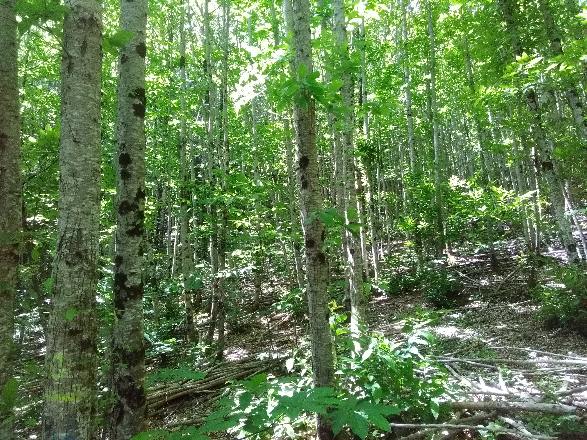

L’Association Syndicale Libre de Gestion Forestière (ASLGF) des Châtaigneraies du Pays Saint-Ponais a été créée en 2023 afin de rassembler des propriétaires forestiers autour d’un projet de valorisation des châtaigneraies locales. 

Le châtaignier occupe une place importante dans notre paysage, notre histoire et notre culture. Pourtant, la déprise agricole et le contexte économique ont impacté la gestion des châtaigneraies et ses débouchés. Comme beaucoup de forêts, les châtaigneraies ont besoin d’attention, d’entretien et d’une gestion adaptée pour continuer à produire un bois de qualité. 

Notre association rassemble actuellement 31 propriétaires forestiers qui souhaitent agir concrètement pour la gestion durable de ces espaces, regroupant ainsi **310 hectares de forêts** sur les communes de Courniou, Saint-Pons-de-Thomières, et Riols, dans l’Hérault. 

Collectivement, nous travaillons à la valorisation de ce patrimoine forestier par la production d’un bois de qualité, pour redynamiser une filière châtaignier en difficulté et créer de l’emploi durable et non délocalisable autour de cette ressource. 

À travers cette page, nous souhaitons partager :
* 🌿 les actions menées par l’ASLGF pour la gestion des forêts
* 🌰 des informations sur les châtaigneraies
* 🛠️ des retours sur les travaux mis en place et la filière châtaignier
* 📅 des événements et rencontres 

N’hésitez pas à suivre nos actualités, à partager nos publications et à nous contacter pour en savoir plus sur l’association, ses actions et la possibilité de nous rejoindre.

Ensemble, soutenons les châtaigneraies du Pays Saint-Ponais ! 🌳🌰
