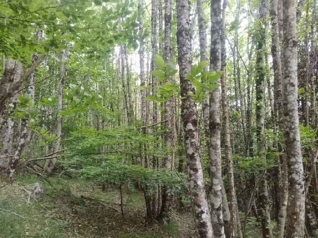

👉 **Et maintenant, que faire pour nos forêts ?** 🍂

Pour répondre à cette question, nous travaillons avec le cabinet de gestion forestière [Alcina Forêts](https://alcina.fr/) qui nous accompagne dans la rédaction d’un Plan Simple de Gestion (PSG) pour notre massif. 

🔎 **Qu’est-ce qu’un plan simple de gestion (PSG) ?** 
C’est un document de gestion durable qui permet aux propriétaires forestiers de réaliser un diagnostic précis de la forêt et planifier la gestion de leur forêt en se fixant des objectifs économiques, patrimoniaux ou encore environnementaux, en tenant compte du potentiel et des contraintes existantes. Il est obligatoire pour toute propriété de 20 ha ou plus située sur une même commune ou sur des communes limitrophes. 

L’équipe d’Alcina a donc visité l’ensemble des parcelles forestières, cartographié, étudié l’environnement et la station (géologie, sol, botanique), dressé un état des lieux du massif et discuté avec nous pour définir les objectifs pour les vingt prochaines années. 

🌳 🌲 Notre massif est composé principalement de châtaigneraies de différents types (taillis jeune, taillis âgé, futaie, ancienne coupe rase) et également d’autres peuplements feuillus (chêne blanc, chêne vert, frêne) et de résineux (cèdre, douglas, sapin, pin). 

Pour accompagner cette diversité, nos objectifs peuvent se résumer ainsi : 

* 🪵 **Valorisation multifonctionnelle et amélioration des peuplements** : maintien du patrimoine paysager, soutien d’une économie locale en circuit court et redynamisation de la filière châtaignier locale ;
* 🤝 **Gestion mutualisée et concertée** : optimisation des moyens en regroupant les efforts pour la réalisation de travaux d’amélioration, de desserte et d’exploitation, dans une logique collective et durable ;
* 🌱 **Expérimentation et innovation sylvicole** : tests de pratiques sylvicoles pour renforcer la résilience des forêts face aux défis écologiques et économiques ;
* 🍃 **Gestion à couvert continu** : maintien d’une ambiance forestière avec un couvert forestier permanent et la pratique d’éclaircies légères régulières. 

✅ Notre plan simple de gestion est actuellement en cours d’évaluation auprès du Centre régional de la propriété forestière dans l’Hérault.

La dynamique est quand même lancée dès cet hiver avec un premier chantier d’éclaircie dans du châtaignier… on revient bientôt avec des nouvelles ! 🪓
